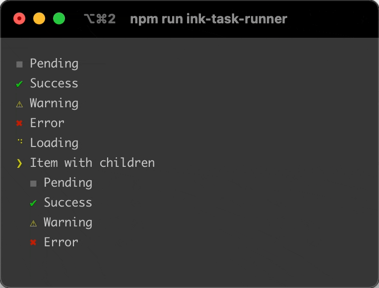
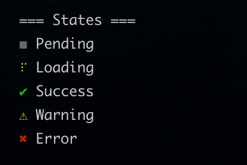
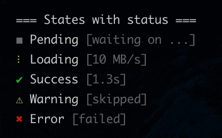
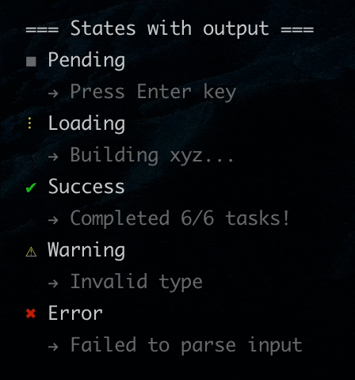
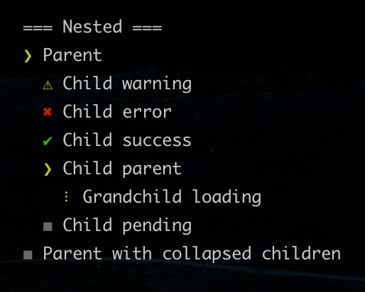

# ink-task-list <a href="https://npm.im/ink-task-list"></a> <a href="https://npm.im/ink-task-list"></a> <a href="https://packagephobia.now.sh/result?p=ink-task-list"></a>

Task list components for [Ink](https://github.com/vadimdemedes/ink)

<p align="center">
  
</p>

<sub>Support this project by ⭐️ starring and sharing it. [Follow me](https://github.com/privatenumber) to see what other cool projects I'm working on! ❤️</sub>

## 🚀 Install
```sh
npm i ink-task-list
```

## 🚦 Quick usage
```tsx
import React from 'react';
import { render } from 'ink';
import { TaskList, Task } from 'ink-task-list';
import spinners from 'cli-spinners';

render(
    <TaskList>
        {/* Pending state */}
        <Task
            label="Pending"
            state="pending"
        />

        {/* Loading state */}
        <Task
            label="Loading"
            state="loading"
            spinner={spinners.dots}
        />

        {/* Success state */}
        <Task
            label="Success"
            state="success"
        />

        {/* Warning state */}
        <Task
            label="Warning"
            state="warning"
        />

        {/* Error state */}
        <Task
            label="Error"
            state="error"
        />

        {/* Item with children */}
        <Task
            label="Item with children"
            isExpanded
        >
            <Task
                label="Loading"
                state="loading"
                spinner={spinners.dots}
            />
        </Task>
    </TaskList>,
);
```

## 🎛 API

### TaskList

Optional wrapper to contain a list of `Tasks`.

Basically just a `<Box flexDirection="column">`; only for styling and semantic purposes.

#### children
Type: `ReactNode | ReactNode[]`

Required

Pass in list of Tasks

### Task

Represents each task.

#### label
Type: `string`

Required

#### state
Type: `'pending'|'loading'|'success'|'warning'|'error'`

Default: `pending`



#### status
Type: `string`

Status of the task to show on the right of the `label`



#### output
Type: `string`

Single-line output prefixed by `→` to show below the `label`



#### spinner
Type:
```ts
type Spinner = {
	interval: number;
	frames: string[];
}
```

Required if state is `loading`

Spinner data used for loading state. Pass in a spinner from [cli-spinners](https://github.com/sindresorhus/cli-spinners) for convenience.

#### isExpanded
Type: `boolean`

Default: `false`

Whether or not to show the children.

#### children
Type: `ReactNode | ReactNode[]`

Pass in one or more `<Task>` components



## 🙏 Credits
The component UI was inspired [listr](https://github.com/SamVerschueren/listr) and [listr2](https://github.com/cenk1cenk2/listr2) ❤️
